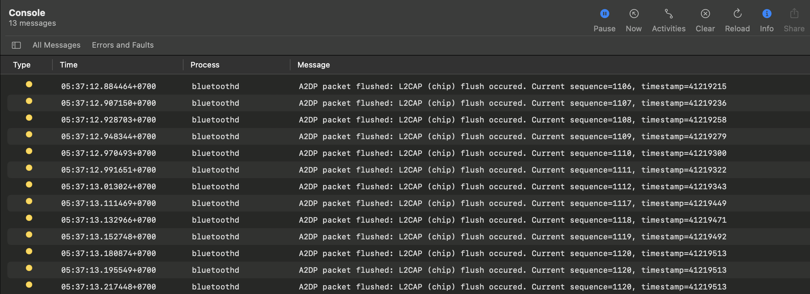
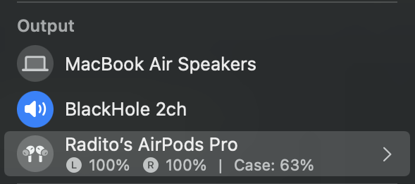
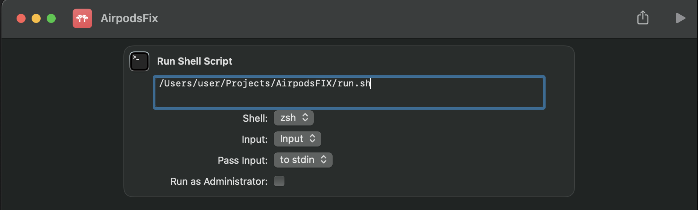

# 🎧 AirpodsFix 
Helper program to prevent Airpods / Audio bluetooth devices from disconnecting on MacOS.

# Background
MacOS is known for having bluetooth issue, this issues include audio stuttering on audio devices, lagging on peripheral devices, and etc. [[1]](https://gist.github.com/xbeta/e60fddd012e95202bbbe)

Setting the ``bluetoothCoexMgmt Hybrid`` is not working for me. The issue keep happening. The issue is present when using Bluetooth devices with WiFi on 2.4 Ghz frequency. When there's traffic on wifi, audio will start disconnecting randomly and that causes inconvenience for the user.

This Helper is specifically made for Audio Devices (Airpods, Bluetooth Speaker) to help prevent bluetooth disconnecting from Mac.

> *This software will not stop stuttering on the audio device but to prevent bluetooth from disconnecting from the devices that requires user to reconnect.*

# How it works
This helper uses macOS kernel logs ``log stream`` to detect if there's a stuttering issue on bluetooth. When there's stuttering happening the event logs shows error 'A2DP packet Flushed'.



The error message keep showing and the airpods will keep stuttering and eventually the bluetooth device will disconnect. The solution to temporarily fix the error is to Switch betwen two interface from `Airpods Pro` to `Blackhole 2ch` and back to `Airpods Pro`. When switching is done, the audio clears out and continue playing without bluetooth disconnecting by itself.

<center>

</center>

# Required Dependencies
* Python 3
* switchaudio-osx
* blackhole-2ch

# How to Setup
To install all dependencies run this script it will automatically install all required program. Make sure you already installed **homebrew**

```
./setup.sh
```

# How to Run
To run the program you can directly run the script
```
./run.sh
```

Or if you wan't to make it more accessible, you can add a new shortcut item on macos. Here's an example.



# Devices
This Helper is currently tested on `Macbook Air M1`<br>
With MacOS Ventura v13.0.1

# Contributing
This project is work in progress. If you have any suggestion or improvement feel free to collaborate.